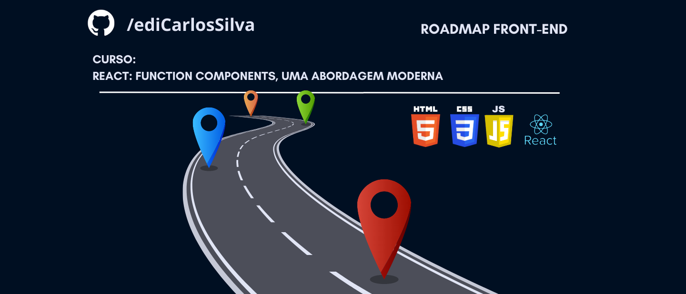

<h1 align="center">Curso sobre Function Components</h1>

### Aprimorar a utilização de components no React que é mais comum nos dias de hoje (ano 2023) através de Funções (function). Em um passado não tão distante a abordagem mais comum era utilizar classes javascript (class)

## Conceitos

- O que é um formulário não controlado

- Problemas com mais de uma fonte de verdade

- Hooks e o useState

- Desconstrução de Arrays

- Assincronicidade da função de atribuição do estado